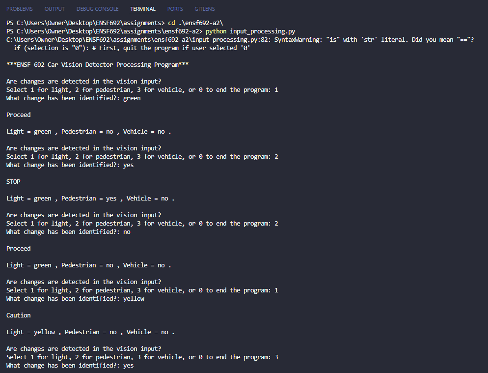
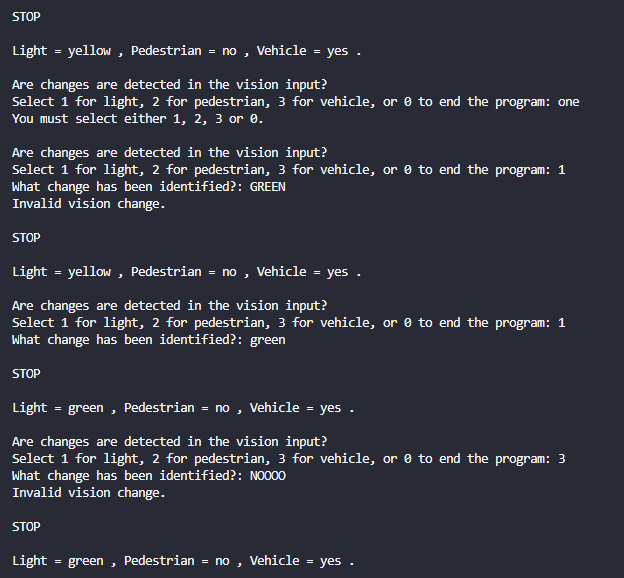
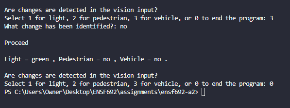

# ENSF 692 Spring 2024 - Assignment 2

Author: Yael Gonzalez

This report is for Assignment 2. The implemenation can be found in `input_processing.py`.

## Specification
The Car Vision Detector Processing Program is a terminal-based application, which simulates the processing of changes detected by a car's vision system. The program uses a sensor to track the traffic lights, the pedestrians, and the nearby vehicles to provide an appropriate action message.

In the code, the terminal-based application runs in `main`, the `Sensor` class stores and updates the status of traffic lights, pedestrians, and nearby vehicles, and, finally, `print_message` processes the appropriate action message given the sensor's current status.

## Execution and Testing
The program was executed via the terminal with `python input_processing.py`. Execution was successful, as showcased in the screenshots below:

<u>MyOutput1.png</u>

<u>MyOutput2.png</u>

<u>MyOutput3.png</u>

